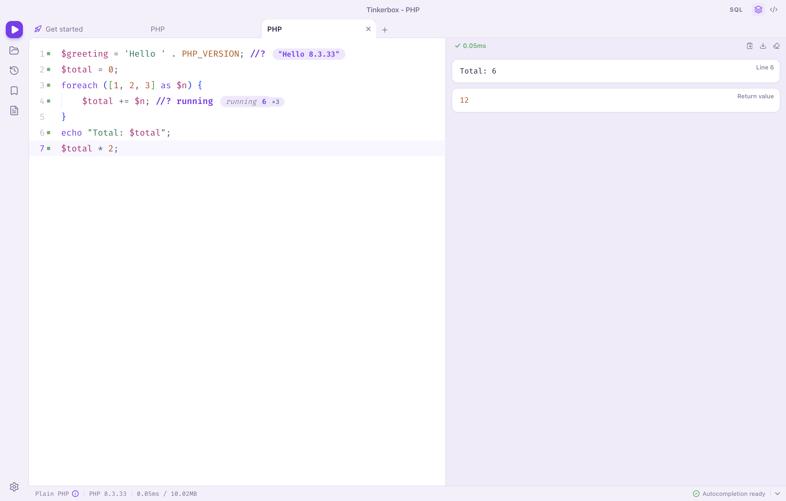
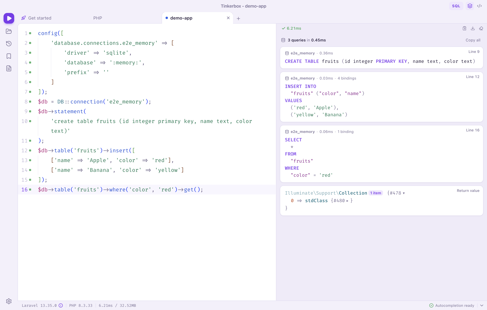
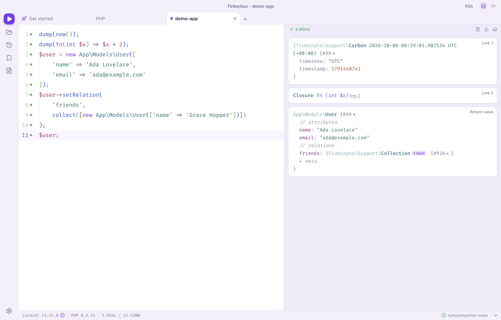
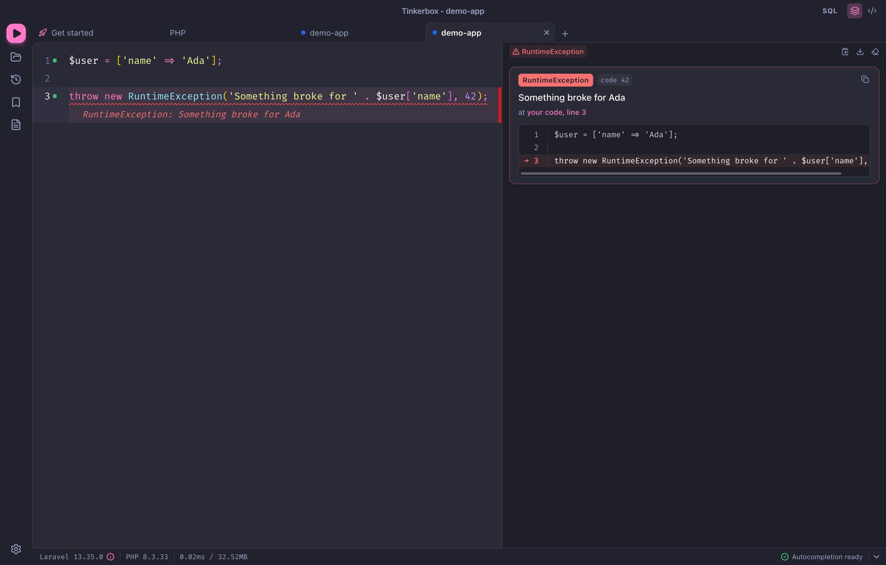

# Tinkerbox

Tinkerbox is an independent, open-source desktop scratchpad for PHP and Laravel. Write a few lines in the editor,
press ⌘R / Ctrl+R, and the code runs inside your project with its framework booted, the way `php artisan tinker`
would run it. The value of the last expression, every dump, the SQL that ran and any exception show up next to the
editor as structured, collapsible output.

It is an Electron app built with Vue 3 and Monaco. Code runs on your own machine with a PHP binary you already
have: nothing is uploaded, and nothing is written into your project.



| SQL queries with bindings filled in | Eloquent models, dates and closures |
| --- | --- |
|  |  |

| Readable exceptions, inline in the editor and in the output |
| --- |
|  |

## Features

**Running code**

- Fresh PHP process per run with the project bootstrapped first; ⌘R / Ctrl+R runs the editor (or only the
  selection), and running again stops a script that is still going.
- `<?php` is optional and a missing trailing semicolon is fine. The value of the last expression is shown, like
  Tinker. Classes and functions declared in the editor just work, and short class names are aliased
  (`User::first()` without the namespace).
- Buffered or real-time output, timeouts and cancelling, `exit` / `die` / `dd()` handled, warnings and deprecations
  collected as diagnostics instead of aborting, execution time and peak memory per run.
- Optional `declare(strict_types=1)`, auto-evaluate (live) mode, and Xdebug step debugging per project.
- A Laravel Sandbox (a full Laravel app installed on demand with Composer) for trying things without a project, and
  a plain PHP mode.

**Frameworks and drivers**

- Built-in drivers for Laravel, Lumen, Laravel Zero, Statamic, October CMS, Testbench, Symfony, WordPress (also
  Bedrock and Radicle), Drupal 7 and 8+, Craft CMS, Magento 2, Shopware, Kirby, Moodle, PrestaShop, TYPO3, CakePHP,
  CodeIgniter 4, Yii 2, Joomla, any Composer project and plain PHP.
- Custom drivers written in PHP, per machine or per project (see [Custom drivers](#custom-drivers)).
- Framework and version in the footer, and a Panels view with App Information (`artisan about`) plus driver panels.

**Output**

- Cards view: one card per echo, dump, query and return value, in execution order, with the source line.
- VarDumper-style collapsible trees; Eloquent models (attributes and relations), collections, Carbon dates, enums,
  closures and query builders rendered specially.
- SQL queries with pretty-printed SQL, bindings substituted and timings.
- Collision-style exceptions with a code snippet and a stack trace (vendor frames collapsed), and inline errors next
  to the failing line.
- Table Preview (search, CSV export, copy rows as PHP or JSON), Object Graph, and HTML Preview for views and mailables.
- A plain CLI mode (⇧⌘C) with PsySH-style text output.

**Editor**

- Monaco with PHP highlighting (no `<?php` needed), magic comments with inline values and timings, and a code
  coverage gutter that marks the lines that ran.
- Autocompletion and hover docs from the running application: PHP functions, project classes, facades, model
  columns, scopes and relations, driver variables and local variables.
- Import missing classes, prettify with Prettier (⌘P), Vim mode, font and zoom settings, word wrap, minimap.

**Workspace**

- Tabs with their own project, output mode and SQL toggle; session restore; a Get started tab with the sandbox,
  recent folders, Herd sites and an example script.
- History (⌘Y), snippets (⌘B, also shared per project in `.tinkerbox/snippets`), a log viewer (⌘L) and Open Anything
  (⇧⌘P) with fuzzy search everywhere.
- Open, save and watch `.php` files (re-run on change).
- PHP auto-detection (Herd, Homebrew, MAMP, XAMPP, Laragon, system, `PATH`) and a PHP binary per project.
- Laravel Herd integration: PHP binaries and aliases such as `php83`, per-version `php.ini`, and Herd sites.
- Built-in and custom themes, OS dark / light sync, customizable shortcuts, layout options and zen mode.
- A `tinkerbox` command-line helper, `tinkerbox://open?cwd=…` deep links and a single-instance window.
- Open dump locations and projects in your editor (VS Code, Cursor, PhpStorm, Sublime Text, Zed and others).

[`docs/FEATURES.md`](docs/FEATURES.md) is the full checklist, with how each feature is verified.

## Requirements

- macOS, Windows or Linux. Packages are configured for all three; development and testing happen on macOS.
- PHP 7.4 or newer (CLI). [Laravel Herd](https://herd.laravel.com) is supported, and Homebrew, MAMP, XAMPP, Laragon
  and system installations are detected too. You can pick a binary per project.
- Composer, only to install the Laravel Sandbox from inside the app (Herd's bundled Composer is used when present).
- To build from source: Node.js 22 or newer (22.12+) and npm.

## Install and run

From a clone of this repository:

```sh
npm install              # dependencies
npm run dev              # start the app with hot reload
```

Packaging:

```sh
npm run dist             # type-check, build and package for the current platform (electron-builder)
npm run dist:mac         # macOS packages (dmg + zip)
npm run prepare:sandbox  # optional: bundle a ready-made Laravel Sandbox into the package
```

Without `prepare:sandbox`, the app installs the sandbox with Composer the first time you use it (Get started →
Laravel Sandbox → Install).

### Installing the app on macOS

```sh
npm run dist:mac
open dist/tinkerbox-0.1.0.dmg   # then drag Tinkerbox into Applications
```

Local builds are ad-hoc signed (no Apple Developer ID needed), so they open normally on the Mac that built them. If
you copy the `.dmg` to another Mac, macOS will warn about an unidentified developer: right-click the app → **Open**
once, or sign and notarize it with your own Developer ID (`mac.identity` in `electron-builder.yml`).

During `npm run dev` the Dock shows the Tinkerbox icon but the name "Electron" — that's Electron's development
runtime. The installed app is called Tinkerbox everywhere. Regenerate the icons from `build/icon.svg` with
`npm run icons`.

**Help → Install Command Line Tool…** adds a `tinkerbox` command, so `tinkerbox .` opens the current folder and
`tinkerbox file.php` opens a file in the running app.

## Usage tips

### Magic comments

End a line with a magic comment to see a value next to it. Values update on every run, and loops show a hit count.

```php
$users = User::latest()->take(3)->get(); //?
$names = $users->pluck('name'); //? names          ← a label
$users; //?->count()                               ← show a method call's result, keep the statement as is
$user; //?->email                                  ← or a property
collect([1, 2, 3])/*?*/->map(fn ($n) => $n * 2);   ← inline: the value to the left of the comment
usleep(2000); /*?.*/                               ← seconds since the script started
```

`#?` works like `//?`, and `/*?->count()*/` works inline. ⇧⌘M adds a magic comment at the end of the current line.

### Custom drivers

A driver tells Tinkerbox how to recognise and boot a kind of project. Drop a PHP file with a subclass of
`Tinkerbox\Drivers\Driver` (or of a built-in driver such as `Tinkerbox\Drivers\LaravelDriver`) into
`<project>/.tinkerbox/drivers/` for one project, or `~/.config/tinkerbox/drivers/` for every project. Custom drivers
are checked before the built-in ones.

```php
<?php // .tinkerbox/drivers/WidgetDriver.php

use Tinkerbox\Drivers\Driver;
use Tinkerbox\Panels\Panel;

class WidgetDriver extends Driver
{
    public function id(): string { return 'widget'; }
    public function name(): string { return 'Widget'; }

    // File-system checks only: is this a Widget project?
    public function canBootstrap(string $projectPath): bool
    {
        return is_file($projectPath . '/widget.json');
    }

    // Boot the framework; the working directory is already the project.
    public function bootstrap(string $projectPath): void
    {
        require $projectPath . '/vendor/autoload.php';
        \Widget\App::boot($projectPath);
    }

    public function version(): ?string { return 'Widget ' . \Widget\App::VERSION; }   // footer label

    // Variables available in the editor (and in autocompletion).
    public function variables(): array { return ['widget' => \Widget\App::instance()]; }

    // Extra entries for the Panels view.
    public function panels(string $projectPath): array
    {
        return [Panel::make('Widget')->section('Status', ['Mode' => 'local'])->toArray()];
    }

    public function logsPath(string $projectPath): ?string { return 'storage/logs'; }   // for the log viewer
}
```

Other hooks: `listenForQueries()` (report SQL to the query cards), `afterRun()`, `prettyErrors()`, `files()` and
`models()` (for autocompletion). The full contract is in [`docs/ARCHITECTURE.md`](docs/ARCHITECTURE.md) (§1.7).

### Project snippets

Snippets in `<project>/.tinkerbox/snippets/*.php` show up in the Snippets modal (⌘B) and in Open Anything for
everyone who opens the project. A docblock sets the label and description:

```php
<?php
/**
 * @label Count users
 * @description How many users signed up today
 */
User::whereDate('created_at', today())->count();
```

## How it works

The main process combines the PHP runner (`resources/php`) and your code into one self-contained script and writes
it to a fresh `php` process's stdin. The runner boots the project through its driver, runs the code, and prints one
JSON envelope that the app parses and renders. The renderer (Vue 3, Pinia, Monaco) talks to the main process through
a typed IPC bridge defined in `src/shared`.

```
src/main/        Electron main process: execution, PHP detection, sandbox, settings, menus, CLI and deep links
src/preload/     the window.tinkerbox bridge
src/renderer/    Vue 3 UI: tabs, Monaco editor, output, modals
src/shared/      types and IPC contracts shared by both sides
resources/php/   the PHP runner, dumper, drivers and introspection (PHP 7.4 – 8.5)
```

Details: [`docs/ARCHITECTURE.md`](docs/ARCHITECTURE.md) (runner, drivers, execution) and
[`docs/RENDERER.md`](docs/RENDERER.md) (renderer APIs).

## Testing

```sh
npm run typecheck                                       # TypeScript (main, preload, renderer)
npx vitest run                                          # unit tests
php -d xdebug.mode=off tests/php/run.php                # PHP runner, dumper and driver tests (any PHP 7.4 – 8.5)
npx electron-vite build && node tests/e2e/smoke.mjs     # end-to-end test of the built app (Playwright)
```

The Laravel integration tests (PHP suite, unit tests and end-to-end test) need a real Laravel app. Point
`TINKERBOX_TEST_LARAVEL` at one — they skip when it's unset:

```sh
composer create-project laravel/laravel /tmp/demo-app
export TINKERBOX_TEST_LARAVEL=/tmp/demo-app
```

The project is used **read-only**: only side-effect-free code runs in it, and the end-to-end test fails if any of
its files change. The end-to-end test runs the app with an isolated profile and writes screenshots to
`tests/e2e/screenshots`.

## Roadmap

Code currently runs through the local transport (a PHP child process). Execution goes through a small `Transport`
interface (`src/main/execution/transport.ts`), so remote targets can be added as new transports without changing
the runner, the data modes or the UI:

- SSH transport (run against a server's PHP)
- Docker transport (run inside a container)
- Kubernetes transport (run inside a pod)

## License

[MIT](LICENSE) © 2026 Haris Shah
